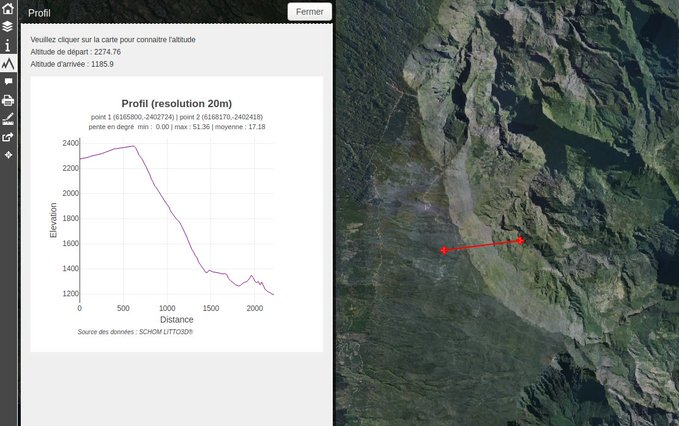
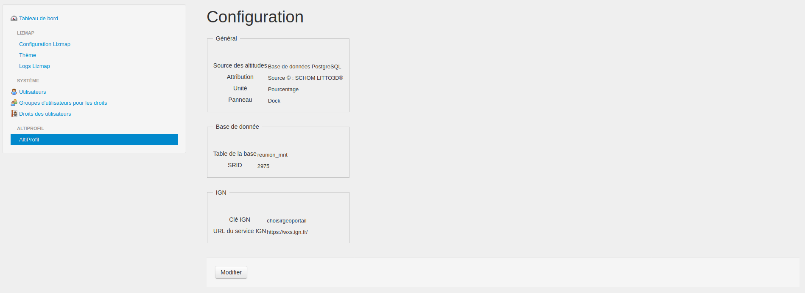

# AltiProfil for Lizmap

[](https://packagist.org/packages/arno974/lizmap-altiprofil)

## Description

This Lizmap module allows you to create **topographic profile**, either from a raster table stored in **PostGIS** or an online
API such as **French IGN** data provider.



## Installation

Use minimum version 0.5.0 with Lizmap 3.8

[Version 0.4.2](https://github.com/arno974/lizmap-altiProfil/releases/tag/0.4.2) is compatible with Lizmap Web Client 3.4 and < 3.8.

You should install it with [Composer](https://getcomposer.org).
If you can't, you must follow the **manual installation** part.

### With Composer

* In `lizmap/my-packages`, create the file `composer.json` if it doesn't exist by copying
  the file `composer.json.dist`. Then launch Composer by specifying the module name to install.

```bash
cp -n lizmap/my-packages/composer.json.dist lizmap/my-packages/composer.json
composer require --working-dir=lizmap/my-packages "arno974/lizmap-altiprofil"
```

* Then go in `lizmap/install/` and execute some scripts :

If you are using Lizmap Web Client 3.6 and higher, launch first :

```bash
php configurator.php altiProfil
php configurator.php altiProfilAdmin
```

* Then, **whatever** the version of Lizmap, launch installation scripts :

```bash
php installer.php
./clean_vartmp.sh
./set_rights.sh
```

Go to the configuration part.

### Manual installation

* Download the ZIP from the [GitHub release page](https://github.com/arno974/lizmap-altiProfil/releases).
* Extract the zip and copy directories `AltiProfil`, and `AltiProfilAdmin`
  in folder `lizmap/lizmap-module/`
* Modules need to be enabled in Lizmap by editing the configuration file `lizmap/var/config`.


For Lizmap 3.4 or Lizmap 3.5, add in the file `lizmap/var/config/localconfig.ini.php`, in the `[module]` section,
the reference to these 2 modules. Do not remove references to other modules in this section.

```ini
[modules]

altiProfil.access=2
altiProfilAdmin.access=2
```

For Lizmap 3.6 or higher, don't modify `lizmap/var/config/localconfig.ini.php`, launch this command instead:

```
php lizmap/install/configurator.php altiProfil
php lizmap/install/configurator.php altiProfilAdmin
```


* Then for any version of Lizmap, launch the installation of the modules with

```bash
php lizmap/install/installer.php
lizmap/install/clean_vartmp.sh
lizmap/install/set_rights.sh
```

## Configuration

It's necessary to go in the administration panel of Lizmap Web Client to set up the module.



This configuration will create or edit the file `lizmap/var/config/altiProfil.ini.php`, which might contain for instance :

```ini
[altiProfil]
altisource=Source of data

;if database
altiProfileProvider=database
altiProfileSchema=dem_schema
altiProfileTable=dem_table
srid=3957
; profilUnit = PERCENT or DEGREES - unit for the profil
profilUnit= PERCENT
; dock panel = dock or minidock or rightdock
dock=dock
altiresolution=DEM resolution

;if IGN French data provider
;altiProfileProvider= ign
ignServiceUrl=https://wxs.ign.fr/
```

You can specify your data source.
Depending on your datasource, some extra configuration might be needed.

### Database

```ini
altiProfileProvider=database
```

### IGN French provider

```ini
altiProfileProvider=ign
```

## Override the configuration for a single project

For every project published in Lizmap, for instance `my_project.qgs`, you can add a new file with extension `.alti` at the end of the file.
In our example, it would be `my_project.qgs.alti`.

This file allows you to override schema and table settings (when altiProfil is configued to use database as data source).

For instance

```ini
[altiProfil]
altiProfileSchema=srtm
altiProfileTable=srtm_paris_high_resolution
```

## Use-case from a database

To use this module with a database, you should connect to a raster table having a DEM.
You need to add in the file `profiles.ini.php` (located in`lizmap/var/config`) the given block :

```ini
[jdb:altiProfil]
driver=pgsql
database=name of database
host=localhost (or URL)
user=the login for the database
password=password for the database
search_path=if the table is in a specific schema, otherwise, let "public"
```

## Cas de l'utilisation à partir de l'API IGN

_French only 🇫🇷_

En raison de l'absence de continuité de service de l'offre Pro IGN, il n'a pas été possible de tester complément l'intégration de l'API.
Les tests effectués ont été réalisés sur la base des exemples donnés dans la documentation.

Il est possible que l'intégration ne soit pas optimale, mais cela devrait tout de même être fonctionnel.
